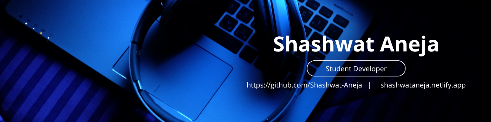

  

# 👋 Hi, I'm Shashwat Aneja  
### Student Developer · AI & VR Enthusiast · Embedded Systems Learner  
Delhi, India  

I build intelligent systems, interactive experiences, and hardware-integrated projects.  
My work spans **AI**, **machine learning**, **game development**, **VR**, **backend engineering**, and **Arduino-based hardware systems**.

I love solving real problems, creating immersive simulations, and understanding how software and hardware come together.

---

## 🚀 What I Do

### **Artificial Intelligence**
- Neural networks & classification models  
- MNIST, custom datasets  
- Data preprocessing, evaluation, predictions  

### **Backend Development (Python)**
- FastAPI-based APIs  
- Automation pipelines  
- Report generation (PDF/CSV/JSON)  
- Scheduling, email workflows  

### **Game & VR Development**
- Unity (C#)  
- Godot  
- Unreal 3D world building  
- VR interactions, gaze UI systems  

### **Embedded Systems**
- Arduino Nano/UNO  
- MPU6050 IMU motion tracking  
- Sensors (LDR, relay modules, keypads)  
- Automation & device control  

### **Web Development**
- HTML, CSS, JS  
- 3D UI components  
- Interactive utilities  

---

## 🛠 Tech Stack

**Languages:** Python, C#, C++, JavaScript  
**Frameworks:** FastAPI, PyTorch, scikit-learn, Unity, Godot  
**Hardware:** Arduino, IMU sensors, LDR, servo/relay modules  
**Tools:** Git, VS Code, Blender, Linux, Render, Netlify  

---

## 📌 Featured Projects

### 🔹 **XYLO — AI Business Automation System**  
Full backend automation suite with:  
AI chat assistant · Invoice OCR · Financial reports · Scheduling · FastAPI backend  
➡️ *Shows AI + backend + automation engineering*

### 🔹 **VR Cricket Simulation**  
Unity-based VR cricket with Arduino MPU6050 bat tracking and AI fielding.  
➡️ *High-impact VR + hardware integration*

### 🔹 **ARC — Asian Royal Conquest (3D Open World Game)**  
Large-scale open world with movement, environment design, and gameplay systems.  
➡️ *Advanced 3D game engineering*

### 🔹 **FastAPI Starter Service**  
A clean, minimal backend template for scalable APIs.  
➡️ *Backend fundamentals and clean architecture*

### 🔹 **MNIST Digit Classifier**  
Neural network trained on MNIST with prediction support.  
➡️ *Core machine learning fundamentals*

---

## 📈 GitHub Stats

---

## 🎯 My Vision  
I want to build systems where **AI**, **real-world sensors**, and **interactive environments** work together to create practical, intelligent, and immersive technology.

Long term, I aim to contribute to **AI research**, advanced automation tools, and interactive simulation systems.

---

## 📬 Contact  
📧 Email: **shashwataneja1401@gmail.com**  
🌍 Location: **Delhi, India**

---

Thanks for visiting — feel free to explore my repositories!  
